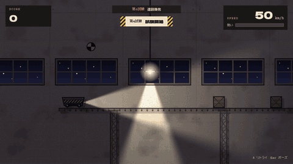
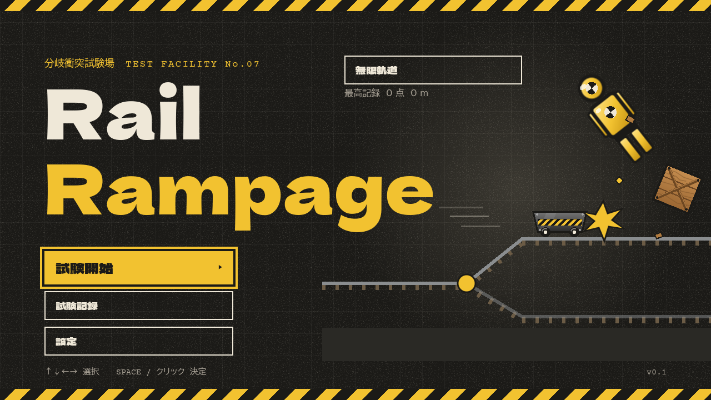
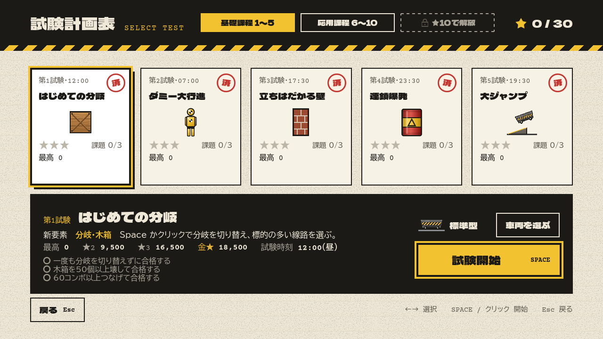
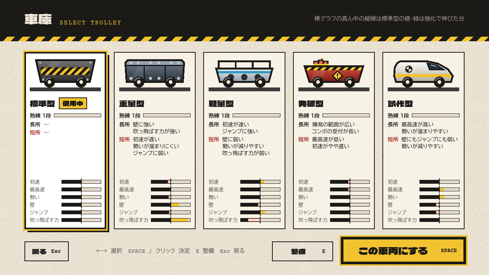

# RailRampage

トロッコ問題を題材にした横スクロールの1ボタン破壊ゲーム。

**▶ ブラウザですぐ遊べる: https://takosasi-dev.github.io/rail-rampage/** （インストール不要。Windows 版は [Releases](https://github.com/takosasi-dev/rail-rampage/releases)）



- **操作は Space（またはクリック）だけ。** 押すと次の分岐が切り替わる
- 標的を壊すほど勢いが溜まって速くなる。壁は速さで突き破り、ジャンプは速さで飛び越える。足りなければ激突・脱線で不合格
- 試験10個＋裏試験5つ、車両5台、終わりの無い「無限軌道」、課題・金★・ゴースト・検定印30個

| タイトル | 試験の選択 | 車庫 |
|---|---|---|
|  |  |  |

- エンジン: Godot 4.7.2 stable（GDScript 2.0、Compatibility レンダラー）
- 動作環境: Windows 10 / 11（64bit）、または WebGL 2 が動くブラウザ
- 開発状況: 開発中（`v0.x`）。数値・条件の多くは仮の値で、試遊しながら調整している

## 入手方法

ビルド済みの Windows 版 exe と Web 版の zip は GitHub Releases から落とせる。

https://github.com/takosasi-dev/rail-rampage/releases

| ファイル | 中身 |
|---|---|
| `RailRampage.exe` | Windows 版。インストール不要、この1ファイルだけで動く（ダブルクリックで起動） |
| `RailRampage_web.zip` | Web 版。展開したフォルダをサーバーで配信してブラウザで開く（下の「遊び方」の Web 版の段落） |

ソースから作るときは下の「ビルド方法」を見る。

## 遊び方

`RailRampage.exe` をダブルクリックする（インストール不要、この1ファイルだけで動く。ソースから書き出したものは `build\RailRampage.exe`）。

- タイトル → 「試験開始」 → ステージ選択（試験計画表）で試験を選んで開始する。第N試験に合格すると第N+1試験が解放される
- 「設定」は「ゲーム」と「画面」のタブ。「ゲーム」は効果音の音量・画面の揺れ・時間帯・記録の消去、「画面」は画質（高・中・低）・FPS 上限・垂直同期・窓／全画面・FPS 表示（変えた瞬間に保存。画質は次に始めた試験から。Web 版は FPS 上限・垂直同期・窓／全画面の行が無い）。画質「中」は破片や煙などの量を半分に、「低」はさらに照明とぼかしの影を切り、暗い時間帯を明るくする
- 車両（トロッコ）は5台。ステージ選択の「車両を選ぶ」で車庫を開いて選ぶ。標準型のほか、重量型（第3試験の合格で解放。壁に強いがジャンプに弱い）、軽量型（第5試験の合格。ジャンプに強いが壁に弱い）、発破型（検定印「連鎖反応」。爆発の範囲が広い）、試作型（検定印「全課程修了」。最高速が高いが壁にもジャンプにも弱い）。壁とジャンプの標識はその車両にとっての必要速度を出す。★と最高得点は車両ごとに残る。性能の値と解放の条件は仮
- 車両は走るほど熟練度（段）が上がる。車庫の「整備」（E）で、段が上がるごとにもらえるポイントを強化（吹っ飛ばす力・爆発の範囲・コンボの受付・ギリギリの幅・壁に強く・ジャンプに強く。速さは上がらない。いつでも振り直せる）に使い、段で解放される塗装（5つ、最後は金）を選べる。数値は仮
- 「試験記録」で、走った回数・合格／激突／脱線・壊した標的（種類ごと）・ギリギリ突破・最高速度・最大コンボ・走った距離の累計と、検定印（実績）30個を見られる。新しく取った検定印はリザルトの右上に出る。全10試験に合格すると「修了証書」がもらえる（最終試験のリザルトと試験記録の画面から開ける）。検定印の条件と数値は仮
- 試験ごとに時間帯（朝・昼・夕方・夜の入り・深夜）が変わり、暗い時間帯は照明とトロッコの前照灯が照らす。設定の「時間帯」で「順に進む」（2試験ずつ朝・昼・夕方・夜の入り・深夜。第1・2試験が朝、第9・10試験が深夜）と「見どころに合わせる」（ステージごとに決めた時間帯）を選べる
- メニューは ↑↓←→ で選び、Space / Enter で決定、Esc で戻る。マウスでも操作できる。ステージ選択の ←→ は試験（カード）を選ぶ。カードは5枚ずつのページ（基礎課程 1〜5／応用課程 6〜10）で、←→ はページをまたいで選ぶ。ヘッダーのタブをクリックしてもページを変えられる（そのページの最初の試験を選ぶ）
- プレイ中:
  - Space / マウス左クリック: 次の分岐を切り替える
  - R: 最初からやり直す（プレイ中・失敗の後・リザルト・ポーズのどこからでも）
  - Esc / P: ポーズ（再開・リトライ・設定・ステージ選択へ）。ウィンドウが裏に回っても自動でポーズする
- F11: 全画面と窓の切り替え（Windows 版。次に起動したときも同じになる。Web 版はブラウザの F11 を使う）
- ゴールすると合格の「試験報告書」、壁に激突・ジャンプで脱線すると不合格の報告書が出る。合格すると最高得点と★が保存される
- ゴースト: 試験ごとに、一番得点の高い合格の走りが半透明のトロッコとして次の走行に重なる（設定の「ゲーム」タブの「ゴースト」で表示／非表示）。検定印は車両ごとの免許・裏試験・金★・課題・熟練度・無限軌道の14個を足して30個
- 試験は10個。基礎課程（第1〜5試験）で要素を1つずつ覚え、応用課程（第6〜10試験）で組み合わせる。分岐では「標的が多い（勢いが溜まる）道」と「少ない道」、壁・ジャンプのある道と迂回が選べる。必要速度と★2・★3 の点数は仮の値
  - 基礎課程: はじめての分岐 / ダミー大行進 / 立ちはだかる壁 / 連鎖爆発 / 大ジャンプ
  - 応用課程: 爆破解体（ドラム缶の爆発に巻き込まれた壁は、速度が足りなくても崩れる）/ 連続ジャンプ（ジャンプが4つ続く。最初のジャンプを迂回すると勢いが落ちて、後のジャンプに届かない）/ 最高速試験（最高速近くが要る壁が3つ）/ 分岐の迷路（分岐が約1秒おきに続く）/ 卒業試験（全要素の総合で一番長い）
  - 裏課程（裏試験1〜5）: 本試験の★の合計（車両をまとめた、試験ごとの最大）が10で裏試験1、14・18・22・26で裏試験2〜5が解放される（ステージ選択の3つ目のタブ）。本試験の要素を組み合わせた難しい試験で、時間帯はいつもステージごとに決めたもの
    - 爆破の関所 / 跳躍と壁 / 迷路の関門 / 最高速の迷路 / 最終検定
- 無限軌道: 検定印「基礎課程修了」で、タイトルの「無限軌道」が押せるようになる。走るたびに違う線路が果てしなく続き、進むほど標的が増え、壁・ジャンプの必要速度が上がる。激突・脱線するまでの得点と距離を競う（最高記録は車両ごと）
- 試験ごとに課題が3つ（「一度も分岐を切り替えずに合格する」など。合格した走行で判定し、一度達成すれば残る）と、★3 の上の金★（閾値は仮）。ステージ選択のカード・詳細パネルとリザルトに出る

記録（`save.cfg`。車両ごとの記録と、試験記録の累計と検定印も入る）と設定（`settings.cfg`。選んでいる車両と画面の設定も入る）は `%APPDATA%\Godot\app_userdata\RailRampage\` に保存される。

Web 版（Releases の `RailRampage_web.zip` を展開したフォルダ、またはソースから書き出した `build\web\`）は `index.html` をダブルクリックしても動かない。ローカルで遊ぶときはサーバーを立てて `http://localhost:8000` を開く（記録はブラウザの保存領域に残る。「終了」ボタンは出ない）。

```
python -m http.server 8000 --directory build/web
```

## 配布

Releases に添えるのは次の2つ（書き出し方は「ビルド方法」）。

| ファイル | 中身 |
|---|---|
| `build\release\RailRampage.exe` | Windows 版（リリース版。右下のデバッグ表示が出ない） |
| `build\RailRampage_web.zip` | Web 版。itch.io に「ブラウザで遊べる」ファイルとしてそのまま上げる（`index.html` が zip の一番上にある）。画面の大きさは 1280×720。スレッドを使わないので SharedArrayBuffer の設定は要らない |

`build\RailRampage.exe`（上の「遊び方」）はデバッグ版で、確かめる用。

## 素材

ゲームのコード・ステージ・効果音は MIT License、フォントは SIL Open Font License 1.1（別々のライセンス。下の「ライセンス」）。

- フォント: `assets/fonts/`（Dela Gothic One・BIZ UDPGothic・Courier Prime、SIL Open Font License 1.1。`LICENSES.txt` を参照）
- 効果音: `assets/sfx/`。`tools/make_sfx.py` で合成した仮の音（外部の素材は使っていない）。差し替えるときは同じ名前の `.wav` か `.ogg` を置く（`CREDITS.txt` を参照）
- ステージ: `data/stages/stage_01.json` 〜 `stage_10.json`、裏試験は `ex_01.json` 〜 `ex_05.json`（読み込み時に検証し、違反があれば「ステージデータエラー」を出してステージ選択に戻る）。「見どころに合わせる」の時間帯は各ファイルの `time_of_day`
- 絵: すべてコードで描いている（画像素材は使っていない）。陰影・木目・壁の模様はコードのぼかしと Godot の雑音の模様（NoiseTexture2D）

## ライセンス

- ソースコード・ステージのデータ・効果音: MIT License（`LICENSE`）
- 同梱のフォント（`assets/fonts/`）: SIL Open Font License 1.1（`assets/fonts/LICENSES.txt`）。MIT ではなく、それぞれの著作者のライセンスのまま

## ビルド方法（開発）

要るもの: Python 3（Godot の用意と効果音の合成）。Web 版の自動確認には Node 22 以降と Chrome か Edge。

Godot 本体と書き出しテンプレート（Windows のデバッグ版・リリース版、Web のスレッド無し版）は `tools\godot\` に置く（git 管理外）。無ければ次で用意する（約200MBをダウンロード。あるファイルは取り直さない）。

```
python tools/setup_godot.py
```

よく使うコマンド（リポジトリ直下で実行）:

```powershell
$g = "tools\godot\Godot_v4.7.2-stable_win64_console.exe"
& $g --headless --path . --import                   # 取り込み（初回と、ファイルを足したとき）
& $g --headless --path . --export-debug "Windows Desktop" build/RailRampage.exe   # 確かめる用の exe を作る
python tools/make_sfx.py                              # 効果音を作り直す

# 配布用（build\release\ と build\web\ は先に作っておく）
& $g --headless --path . --export-release "Windows Desktop" build/release/RailRampage.exe
& $g --headless --path . --export-release "Web" build/web/index.html
Compress-Archive -Path build\web\* -DestinationPath build\RailRampage_web.zip -Force
```

`build\` には `.gdignore` を置いてある（無いと Godot が Web 版のアイコン画像を素材として取り込み、次の書き出しに混ざる）。

自動確認（失敗があれば終了コード1。物理を実フレームで進めるので `--fixed-fps 60` を付ける。付けないと実時間で進む）:

```powershell
foreach ($t in "checks", "checks_ui", "checks_select", "checks_result", "checks_flow", "checks_stages", "checks_art", "checks_fx", "checks_records", "checks_records_screen", "checks_certificate", "checks_display", "checks_options", "checks_garage") {
  & $g --headless --path . --fixed-fps 60 -s "tests/$t.gd"
}
```

| スクリプト | 確かめること |
|---|---|
| `checks.gd` | ゲーム本体（線路・分岐・破壊・勢い・失敗・演出・効果音・HUD・ポーズ・リザルトへの移動） |
| `checks_ui.gd` | タイトル・設定画面 |
| `checks_select.gd` | ステージ選択と記録の保存・解放 |
| `checks_result.gd` | リザルト（試験報告書） |
| `checks_flow.gd` | キーボードだけでの画面遷移（AC-22） |
| `checks_stages.gd` | ステージ1〜10の検証と、全ルートを実際に走らせたレベル設計の規則（約3〜4分）。番号を付けるとそのステージだけ確かめ、ルートごとの得点と wall・jump の到達速度も出す（例: `-s tests/checks_stages.gd -- 7 9`）。`-- trolley=prototype` のように車両を付けると、その車両で全経路を走らせ、分岐の1秒前の見え方（L-3）とデータの規則だけを確かめる（車両の性能やカメラを変えたら4台分回す）。`-- ex` で裏試験5つ、`-- ex=2` で裏試験2だけを確かめる（`-- trolley=` と組み合わせられる。裏試験は車両ごとの L-5・★3 と、課題3つ・金★の達成も実走で確かめる。1台で約10分） |
| `checks_art.gd` | プレイ画面の絵（時間帯の決め方と設定、ぼかし・影・支柱・照明の置き方、光る物）。描画のエラーは終了コードに出ないので、出力に `SCRIPT ERROR` が無いことも見る |
| `checks_fx.gd` | 演出と手触り（壊れ方・爆発の火の玉と衝撃波と閃光・スピード線と火花・激突と着地の揺れ・ゴールのテープと紙吹雪・演出の数の上限） |
| `checks_records.gd` | 試験記録の累計と検定印のデータ（足し方・条件の境目・保存と読み込み・記録の消去）、ゲームから走行1回分を出すこと、F11 の全画面 |
| `checks_records_screen.gd` | 試験記録の画面とタイトルの「試験記録」（表の値・検定印の見分け・キーボードでの移動・修了証書を開く） |
| `checks_certificate.gd` | 修了証書と、リザルトの「新しい検定印」の札・「修了証書を受け取る」ボタン |
| `checks_options.gd` | 車両と画面の設定のデータ（画面の設定の保存・車両の性能の値と解放の条件・選んでいる車両・車両ごとの記録と古い記録・ゲームが車両の性能〔初速・最高速・勢い・壁とジャンプの必要速度と標識・吹っ飛ばす力・爆発の範囲・コンボの受付〕を使うこと） |
| `checks_garage.gd` | 車庫（開閉・キーボードとマウス・解放済みだけ選べる・錠前と解放の条件）、ステージ選択の車両ごとの記録と閾値、リザルトの使用車両と新しい車両の知らせ、5台の絵の違い |
| `checks_trolleys.gd` | 車両の性能の調整の約束（5台 × 全ステージ × 全経路: どの車両でも全試験に合格でき ★3 に届く・長所と短所が効く・長所と短所の文が値と合う）。約25〜30分かかるので、ふだんの一覧には入れていない。性能の値を変えたら回す。`-- heavy 3 5` のように絞ると経路ごとの結果を出す |
| `checks_display.gd` | 画面の設定（設定画面の「ゲーム」「画面」のタブのマウスとキーボードでの切り替え・画面の各項目の保存・F11・Web 版で隠す行・画質ごとの照明と影と演出の数・次の試験から効くこと・FPS 表示） |
| `check_web.mjs` | Web 版を `python -m http.server` で配信し、窓を出さない消音の Chrome で開いて、キーボードだけでステージ1をクリアし、試験記録の累計も含めて開き直しても記録が残るか（AC-16、約1分）。`node tests/check_web.mjs` で回す（先に Web 書き出し。Node 22 以降と Chrome か Edge が要る）。画面の写しは `build\web_check\`。共通部品は `tests/web_lib.mjs` |
| `shoot_web.mjs` | プレイ画面の絵の見た目の確かめ。Web 版を窓なし・消音の Chrome で開き、タイトル・ステージ選択（2ページ）・設定・試験記録・修了証書・車庫・ポーズと、第1〜10試験を時間帯 A「順に進む」と C「見どころに合わせる」で撮る（約10分）。`node tests/shoot_web.mjs`（先に Web 書き出し）。画面の写しは `build\web_shots\` |
| `shoot_readme.mjs` | README の絵（`docs/images/`）の元を撮る。Web 版を窓なし・消音の Chrome で開き、タイトル・ステージ選択・車庫と、走っているところの連続写真を撮る（約1分）。`node tests/shoot_readme.mjs [第何試験か]`。写しは `build
eadme_shots\`。GIF は `ffmpeg -framerate <撮れた fps> -i burst/%04d.jpg -t 7 -vf "fps=12,scale=480:-1:flags=lanczos,split[a][b];[a]palettegen=max_colors=64:stats_mode=diff[p];[b][p]paletteuse=dither=bayer:bayer_scale=5:diff_mode=rectangle" play.gif` で作る |

- 自動確認は確認用のファイルに記録・設定を保存し、遊んでいる人の記録・設定には触れない
- 想定どおりに出るエラー表示: `checks.gd` は効果音が無いときの確認で12件の警告と、壊したステージの検証エラー1件。`checks_ui.gd` と `checks_select.gd` は壊れた設定・記録ファイルを読む確認で ConfigFile の parse error を1件ずつ
- ステージの JSON を直したら `checks_stages.gd` を回す（必要速度が到達速度より 50px/s 以上低いか、分岐の1秒前に判断材料が見えるか、などを実走で確かめる）

確かめる用の exe はデバッグ版で書き出す（右下の FPS 表示と `Tuning.DEBUG_FIXED_SPEED` はデバッグ版でしか効かないため）。エディタで開くときは `tools\godot\Godot_v4.7.2-stable_win64.exe` を起動する。
